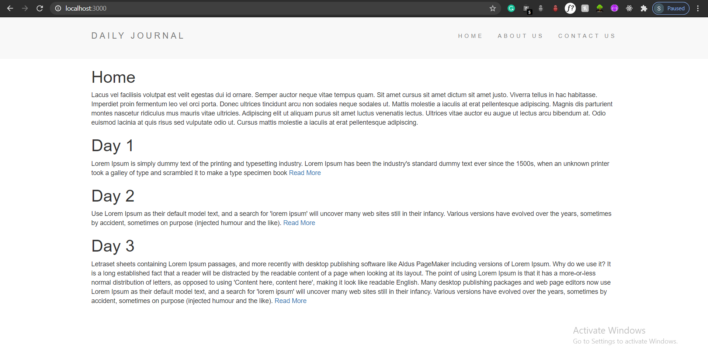
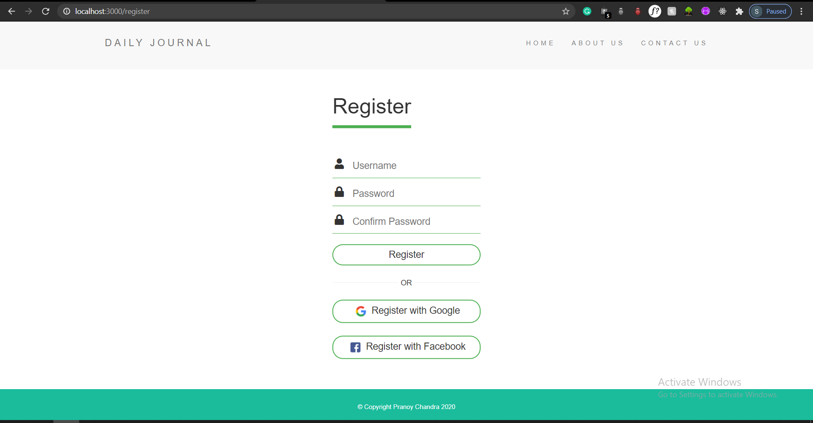
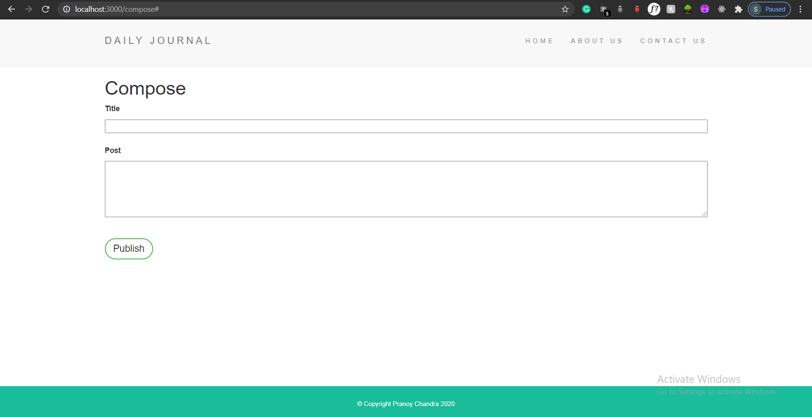
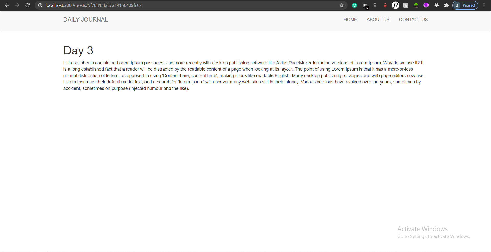

# Blogitude
### Personal Blog web-based application. Here I post what did I learn today about technology, concept, idea, data-structure or algorithm, web development or designing.
#### Features:


###### 1. This is the homescreen of the application. Where you can see all the posts and can read any post on detail by clicking on read more.

<hr />

###### 2. It has manual as well as google and facebook oauth authentication.

<hr />


###### 3. This is the compose screen, where you can add posts.

<hr />

###### 4. By clicking on the read more button you are going to land up on separate specific post page, so that you can read the whole material.

<hr />

###### If you wish to add any another feautre to it, feel free to download the project and contribute.
###### In the root directory.
```
npm install

mongod

nodemon app.js
```
